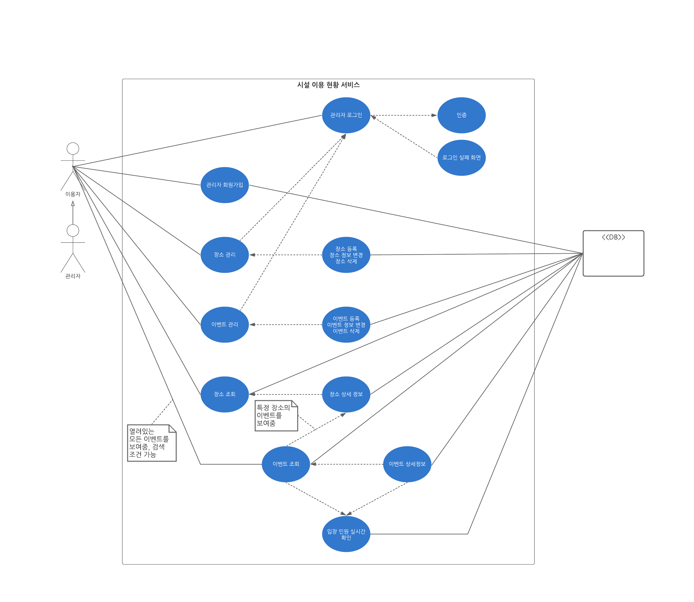
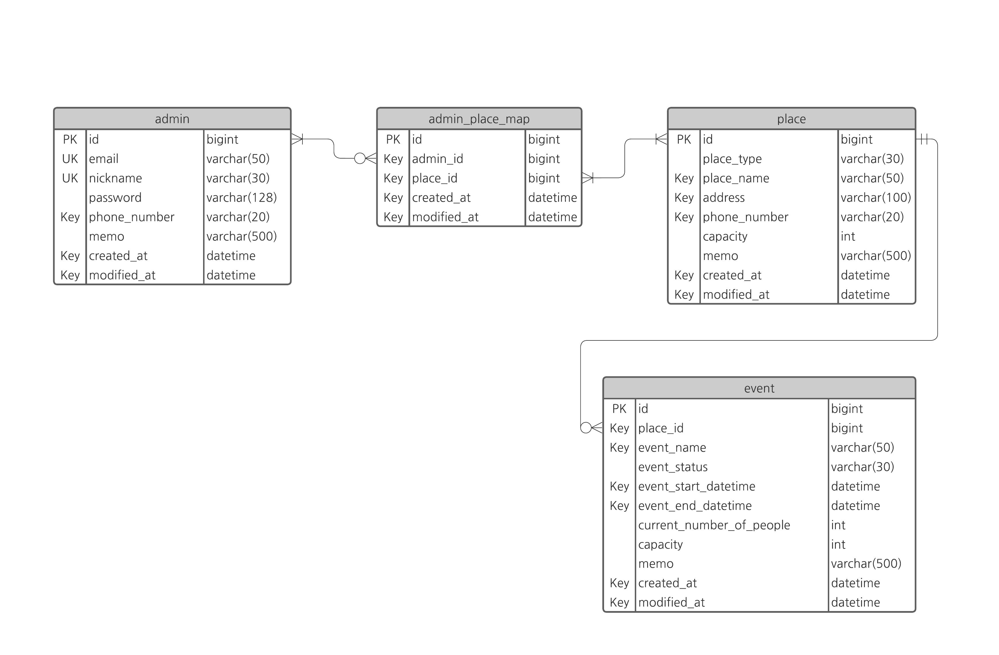

# Aligong_Project
- 공공 시설 이용 현황 알림 서비스 프로젝트 알리공

# 프로젝트 개요

## Why?

- 시, 군, 도립 단위의 규모가 큰 공공 시설은 상주 직원, 연락처가 구비되어 있어 현재 시설의 이용 현황, 이벤트 등 여러 정보를 얻을 수 있지만, 작은 단위의 공공 시설은 정보를 얻기 어려움
- 다목적 체육 시설, 개방된 학교 강당, 사회복지 시설 등 지역 생활권 주민들이 많이 이용하지만 현황 정보를 온라인으로 얻기 어려움
  - 직접 방문해서 정보를 얻어야 하는 경우 발생
  - 시설 이용 목적으로 방문 했지만 제한 인원을 초과한 경우 큰 낭패를 얻을 수 있음 (불편함 발생)

## 요구 사항

- 온라인으로 실시간 이용 현황, 이벤트 정보를 알려주는 서비스
- 이용자의 니즈
  - 관리자: 니즈가 크지 않음 (대부분 공무원, 학교 경비원으로 이용 현황을 알려줄 의무가 크게 없음)
  - 이용자: 정보가 신뢰성 있다면 니즈가 충분함
- 사용성
  - 관리자: 사용법이 매우 쉬워야 함
  - 이용자: 직접 방문해 정보를 얻는 것 보다 편해야 함 

## 기능 목록

### 관리자

- 반응형 웹을 통해 PC 웹, 모바일 접근이 편해야 함
- 관리자 인증 회원가입 기능
- 시설 관리 기능
- 이용 현황 정보, 이벤트 업로드 기능

## 이용자

- 반응형 웹을 통해 PC 웹, 모바일 접근이 편해야 함
- 전체 시설 리스트 조회 기능
- 특정 시설 현황 정보 열람 기능

## Use Case

## ERD

